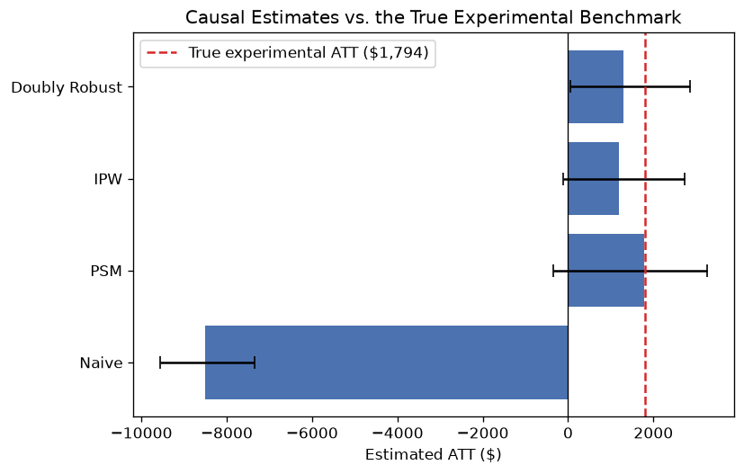
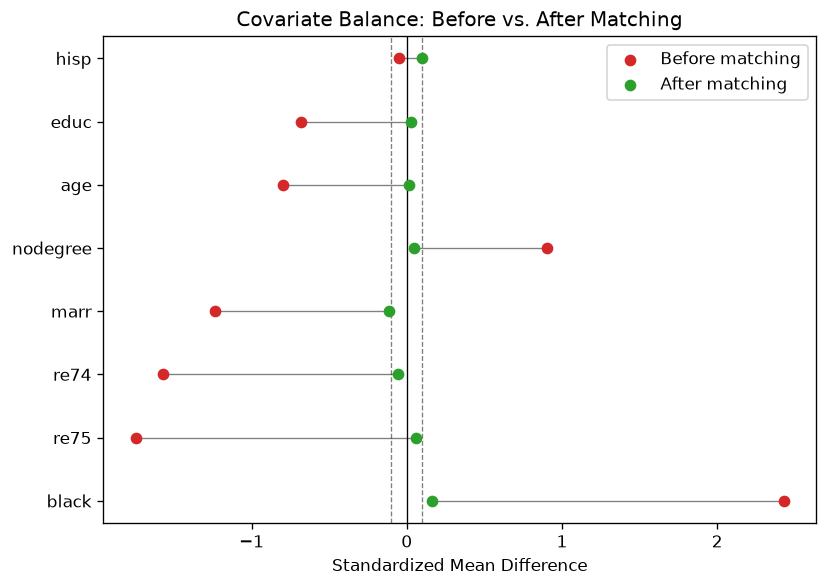

# Does Job Training Actually Increase Earnings? A Causal Inference Replication

A from-scratch implementation of propensity score matching, inverse probability
weighting, and doubly robust (AIPW) estimation - benchmarked against ground
truth from a real randomized experiment.

## The question

In the 1970s, the National Supported Work (NSW) program randomly assigned
disadvantaged workers to either receive job training or not, then tracked
their earnings. Because assignment was randomized, a simple difference in
average earnings between the two groups is an unbiased estimate of the
training program's effect.

LaLonde (1986) asked a different question: **what happens if you don't have
a randomized control group?** In practice, most program evaluations don't.
He replaced the experimental control group with a much larger, non-randomized
comparison group drawn from the Current Population Survey (CPS), and checked
whether standard econometric techniques of the time could still recover the
true effect. They mostly couldn't - which became one of the most-cited
results in the causal inference literature, and the reason this exact dataset
is still the standard benchmark for any new causal estimator.

This project replicates that test for three modern methods: propensity score
matching, inverse probability weighting (IPW), and augmented IPW
(doubly robust estimation).

## The result

| Method | Estimated ATT | 95% CI |
|---|---|---|
| **True effect (randomized experiment)** | **$1,794** | — |
| Naive difference in means | **−$8,498** | (−9,555, −7,356) |
| Propensity score matching | $1,725 | (−352, 3,250) |
| Inverse probability weighting | $1,192 | (−111, 2,739) |
| Doubly robust (AIPW) | $1,300 | (36, 2,886) |



The naive comparison doesn't just miss the true effect - it gets the sign
wrong, implying training cost people over $8,000 a year. That's a textbook
case of confounding: the CPS comparison group is older, far more educated,
much higher-earning before the program even started, and overwhelmingly less
likely to be Black than the people who actually went through job training
(full numbers below). None of those differences are caused by the training
program, but a naive comparison can't tell the difference.

All three causal methods land within roughly $500-$600 of the true effect and
get the sign right. None of them recover the experimental benchmark exactly -
which is itself an honest and expected result. The point of this project
isn't to claim these methods are perfect; it's to show, with a verifiable
ground truth, how much closer they get than a naive comparison, and to be
specific about where they still fall short (see [Limitations](#limitations)).

## Why the naive comparison fails

| Covariate | Treated (job trainees) | CPS comparison group |
|---|---|---|
| Age | 25.8 | 33.2 |
| Years of education | 10.4 | 12.0 |
| Black | 84% | 7% |
| Married | 19% | 71% |
| No high school degree | 71% | 30% |
| Earnings in 1974 | $2,096 | $14,017 |
| Earnings in 1975 | $1,532 | $13,651 |

These are two very different populations. The CPS group was already earning
roughly 7x more than the treated group before the program started. Without
adjusting for that, "job training increases earnings" and "people who were
already higher earners didn't need job training" are indistinguishable from
the data alone.

## Method

**Propensity score matching** estimates each person's probability of
receiving treatment given their observed characteristics (age, education,
race, prior earnings, etc.), then matches each treated unit to the
non-treated unit with the closest score. The idea: two people with the same
propensity score looked equally likely to end up treated, so comparing their
outcomes approximates a randomized comparison.

**Inverse probability weighting (IPW)** takes a different approach to the
same problem - instead of discarding unmatched units, it reweights everyone
in the comparison group by how "treatment-like" they looked, so a
control-group member who closely resembled a treated person counts more.

**Doubly robust estimation (AIPW)** combines both: an outcome regression
model and the propensity weights. It stays valid if *either* model is roughly
right, not just one - which is what "doubly robust" refers to.

All three are implemented from scratch in `src/` (`sklearn` is only used for
the underlying logistic/linear regression fits, not for the causal logic
itself). Confidence intervals come from a 200-500 iteration bootstrap.

### Covariate balance before and after matching



Before matching, every covariate is badly imbalanced - Black status alone has
a standardized mean difference (SMD) of 2.43, more than 20x the usual
"acceptable" threshold of 0.1. After matching, every covariate falls inside
or close to that ±0.1 band. This is the actual mechanism behind why the
matched estimate moves so much closer to the truth: it's not a statistical
trick, it's that the matched comparison group genuinely looks like the
treated group on every observed characteristic.

## Limitations

- **Common support is thin.** Most of the CPS sample has a near-zero
  estimated probability of treatment, while the treated group spans a much
  wider range (see `results/figures/propensity_overlap.png`). Trimming to
  common support drops roughly two-thirds of the comparison pool before any
  matching happens. This is a known, structural feature of this dataset, not
  a bug in the implementation - and it's exactly why the bootstrap confidence
  intervals are wide enough to include zero for two of the three methods.
- **All three methods assume no unobserved confounding** - that earnings
  differences are fully explained by the covariates collected (age,
  education, race, marital status, prior earnings). If something
  unmeasured (e.g. motivation, local job market) affects both treatment
  and outcome, every method here, including AIPW, is biased in the same
  direction.
- **The propensity model is a plain logistic regression.** A more flexible
  model could fit the treatment assignment mechanism better, but on a sample
  this size (445 treated + control vs. ~16,000 non-experimental controls) it
  also risks pushing scores toward 0/1 and destroying common support
  entirely — which is why a simple model was chosen deliberately, not by
  default.

## Project structure

```
causal-lalonde/
├── run_analysis.py        # end-to-end pipeline — run this
├── src/
│   ├── data_loader.py      # loads the NSW + CPS data
│   ├── balance.py          # covariate balance diagnostics (SMD)
│   ├── propensity.py       # propensity scores + matching
│   ├── estimators.py       # naive / IPW / doubly robust ATT estimators
│   └── visualize.py        # love plot, overlap plot, results plot
├── tests/
│   └── test_estimators.py  # sanity checks against synthetic data with a known effect
├── results/                # generated tables + figures
└── requirements.txt
```

## Running it

```bash
pip install -r requirements.txt
python run_analysis.py
```

This regenerates everything in `results/` from the raw data — there's no
cached output checked into the repo.

To run the test suite:

```bash
pip install pytest
pytest tests/ -v
```

The tests don't touch the real LaLonde data at all — they build a small
synthetic dataset with a treatment effect of exactly $500 baked in, then
check that each estimator actually recovers something close to $500. If an
estimator can't pass that check on data where the answer is known, it has no
business being trusted on data where it isn't.

## Data source

Dehejia & Wahba's (1999) reprocessed version of the LaLonde (1986) NSW/CPS
data, distributed through the [`causaldata`](https://pypi.org/project/causaldata/)
package (Cunningham, *Causal Inference: The Mixtape*).

## References

- LaLonde, R. (1986). Evaluating the Econometric Evaluations of Training
  Programs with Experimental Data. *American Economic Review*.
- Dehejia, R., & Wahba, S. (1999). Causal Effects in Nonexperimental Studies.
  *JASA*.
- Lunceford, J. K., & Davidian, M. (2004). Stratification and weighting via
  the propensity score in estimation of causal treatment effects.
  *Statistics in Medicine*.
